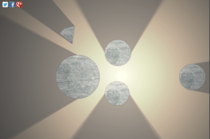
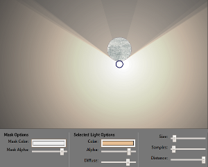

---

Comparing Circles using tangents to original
============================================

The [Good](http://josher19.github.com/illuminated.js/index.html#{"lights":[{"instance":"Lamp","position":{"x":337,"y":218},"distance":500,"diffuse":0.8,"color":"rgba(254,202,140,0.7385237651877105)","radius":3,"samples":7,"angle":0,"roughness":0}],"objects":[{"instance":"DiscObject","center":{"x":649,"y":190},"radius":37},{"instance":"DiscObject","center":{"x":338,"y":152},"radius":38},{"instance":"PolygonObject","points":[{"x":214,"y":75},{"x":207,"y":127},{"x":171,"y":96},{"x":184,"y":81}]},{"instance":"DiscObject","center":{"x":552,"y":222},"radius":38},{"instance":"DiscObject","center":{"x":336,"y":269},"radius":35},{"instance":"DiscObject","center":{"x":223,"y":221},"radius":63}],"globals":{"maskcolor":"rgba(0,0,0,0.9)"}})
vs. [original](http://demo.greweb.fr/illuminated.js/#{"lights":[{"instance":"Lamp","position":{"x":337,"y":218},"distance":500,"diffuse":0.8,"color":"rgba(254,202,140,0.7385237651877105)","radius":3,"samples":7,"angle":0,"roughness":0}],"objects":[{"instance":"DiscObject","center":{"x":649,"y":190},"radius":37},{"instance":"DiscObject","center":{"x":338,"y":152},"radius":38},{"instance":"PolygonObject","points":[{"x":214,"y":75},{"x":207,"y":127},{"x":171,"y":96},{"x":184,"y":81}]},{"instance":"DiscObject","center":{"x":552,"y":222},"radius":38},{"instance":"DiscObject","center":{"x":336,"y":269},"radius":35},{"instance":"DiscObject","center":{"x":223,"y":221},"radius":63}],"globals":{"maskcolor":"rgba(0,0,0,0.9)"}})
-- fixes light so shardows are tangent to circles.

 

The [Ugly](http://josher19.github.com/illuminated.js/index.html#{"lights":[{"instance":"Lamp","position":{"x":346,"y":213},"distance":500,"diffuse":0.8,"color":"rgba(233,192,148,0.8347624763846397)","radius":2,"samples":6,"angle":0,"roughness":0}],"objects":[{"instance":"DiscObject","center":{"x":346,"y":170},"radius":35}],"globals":{"maskcolor":"rgba(0,0,0,0.9)"}}) 
vs. [original](http://demo.greweb.fr/illuminated.js/#{"lights":[{"instance":"Lamp","position":{"x":346,"y":213},"distance":500,"diffuse":0.8,"color":"rgba(233,192,148,0.8347624763846397)","radius":2,"samples":6,"angle":0,"roughness":0}],"objects":[{"instance":"DiscObject","center":{"x":346,"y":170},"radius":35}],"globals":{"maskcolor":"rgba(0,0,0,0.9)"}})
-- shadow is somewhat "faded" when directly north of bright light.

 

---
